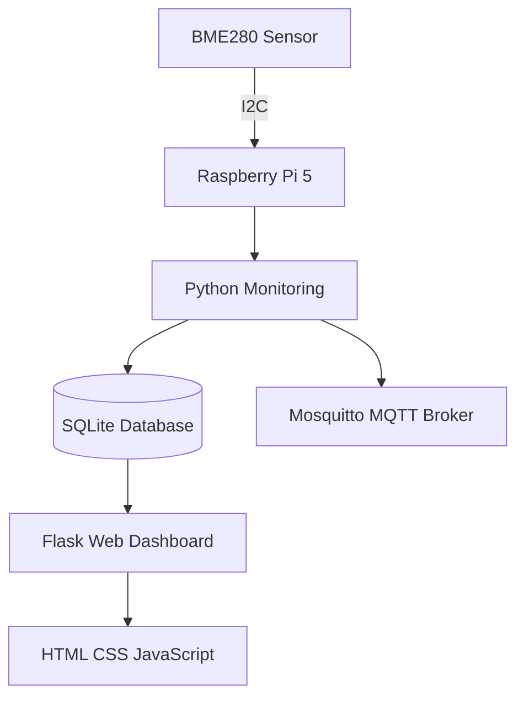

# IoT System Architecture

```mermaid
flowchart TD
    A[BME280 Sensor] -->|I2C| B[Raspberry Pi 5]
    B --> C[Python Monitoring]
    C --> D[(SQLite Database)]
    C --> E[Mosquitto MQTT Broker]
    D --> F[Flask Web Dashboard]
    F --> G[HTML CSS JavaScript]
```
